# Chatty

Chat de texto en tiempo real con salas públicas, conversaciones directas, respuestas con cita y confirmaciones de entrega y lectura. Desarrollado con **Vue, TypeScript y Spring Boot**, con comunicación REST/STOMP y almacenamiento temporal en H2.

**[Ejecutar en local](#instalación)** · **[Arquitectura detallada](docs/chat-architecture.md)**

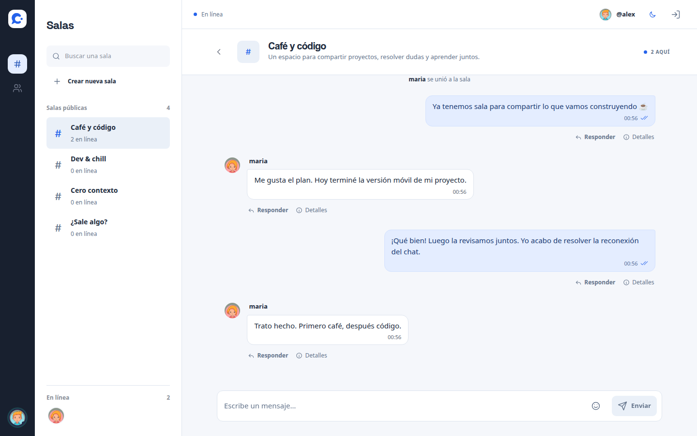

## Contenido

- [Sobre el proyecto](#sobre-el-proyecto)
- [Módulos](#módulos)
- [Arquitectura](#arquitectura)
- [Modelo de datos](#modelo-de-datos)
- [Instalación](#instalación)
- [Cómo probar el proyecto](#cómo-probar-el-proyecto)
- [Tecnologías](#tecnologías)
- [Estructura del código](#estructura-del-código)
- [Datos y alcance](#datos-y-alcance)

## Sobre el proyecto

Chatty permite entrar con un alias, elegir una foto de perfil y conversar desde el celular o la computadora. Incluye tres salas iniciales y permite crear nuevos espacios o escribir directamente a otra persona.

Es un proyecto fullstack de portfolio centrado en los problemas de un chat: mantener presencia, autorizar suscripciones, ordenar el historial, recuperarse de una desconexión y distinguir entre enviar, entregar y leer. La interfaz usa el backend real en todos los recorridos.

El alcance es deliberadamente **solo texto**, sin adjuntos, llamadas ni carga de imágenes. Las fotos de perfil son recursos incluidos en la aplicación. Los datos son efímeros y el proyecto se puede ejecutar sin cuentas externas, claves de API ni una base de datos instalada.

## Módulos

### 1. Acceso y sesión

El formulario valida un alias de 3 a 20 caracteres y permite seleccionar una de seis fotos. El servidor emite una credencial temporal que identifica la sesión tanto en REST como en WebSocket.

- El alias visible y la foto se eligen por separado.
- La credencial se conserva en `sessionStorage`, dentro de la pestaña.
- Cerrar sesión revoca la credencial y termina sus conexiones.
- Los aliases usados quedan reservados hasta el reinicio de los datos para evitar que otra sesión herede sus conversaciones.

<details>
<summary>Ver pantalla de acceso</summary>

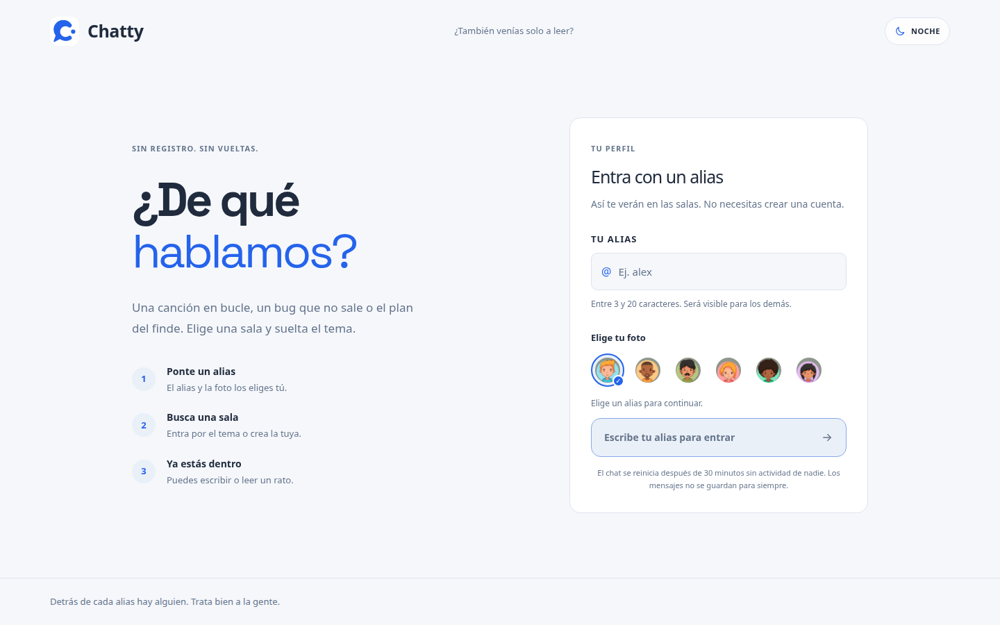

</details>

### 2. Salas y presencia

El directorio permite buscar salas, consultar cuántas personas están conectadas y crear una sala con nombre y descripción. La presencia cambia con las conexiones y suscripciones STOMP; entrar y salir produce eventos en la conversación.

En escritorio, el directorio permanece junto al chat. En móvil se abre como un panel y se cierra al seleccionar una conversación. Las confirmaciones de navegación aparecen como avisos temporales.

<details>
<summary>Ver creación de una sala</summary>

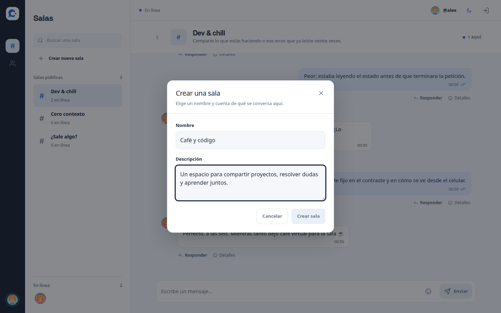

</details>

<p>
  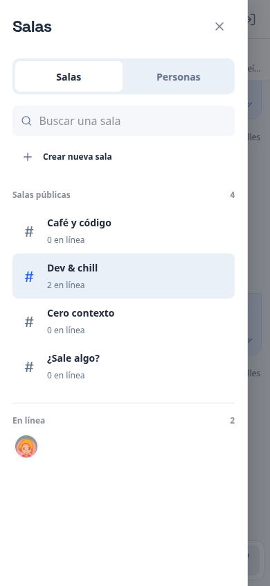
  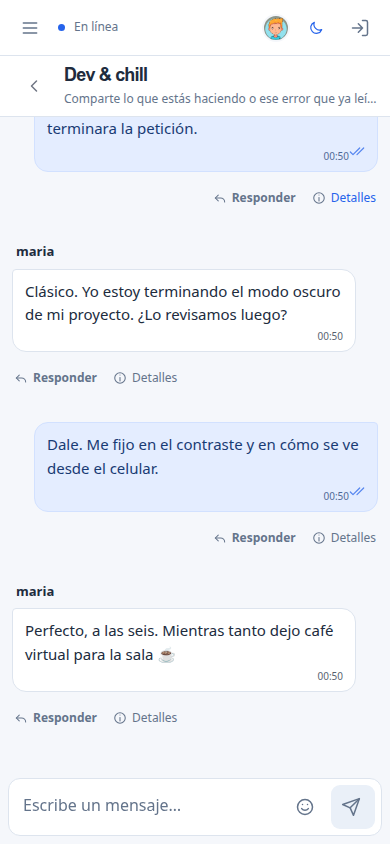
</p>

### 3. Mensajes directos, citas y textos largos

Desde **Personas** se abre una conversación entre dos usuarios. El backend comprueba que quien consulta el historial o confirma un mensaje participe en ese directo.

- Respuestas con una copia del texto citado y su autor.
- Mensajes de hasta **10 000 caracteres**, con saltos de línea y emojis.
- Textos extensos plegados mediante **Leer más** y **Ver menos**.
- Historial paginado y combinación de mensajes REST con eventos en vivo, sin duplicarlos por ID.

<details>
<summary>Ver conversación directa con cita y texto largo</summary>

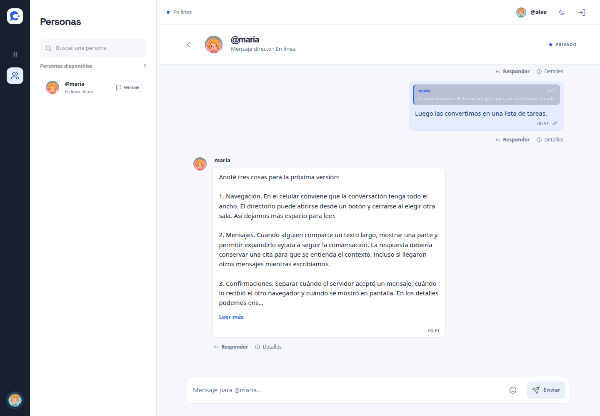

</details>

### 4. Entrega, lectura y detalles

Cada mensaje propio muestra su estado. **Detalles** abre el mismo estilo de diálogo utilizado para crear salas y permite consultar las horas de envío, entrega y lectura por persona.

| Estado | Qué significa |
| --- | --- |
| Enviado · un check | El servidor aceptó y guardó el mensaje. |
| Entregado · dos checks | El navegador receptor confirmó que recibió el mensaje, en vivo o desde el historial. |
| Leído · checks con el color de acento | El receptor mostró el mensaje con la pestaña visible y enfocada. |

Un texto largo debe expandirse y mostrar su final para confirmar lectura. Las fechas las asigna el servidor y se conserva la primera confirmación. En salas, los contadores indican quiénes confirmaron: no existe un estado «todos leyeron» porque no hay una lista fija de destinatarios.

<p>
  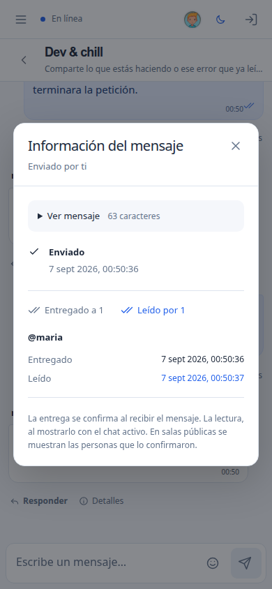
  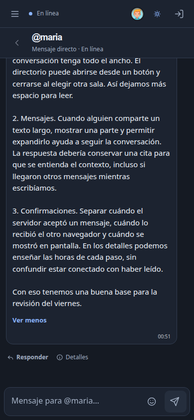
</p>

<details>
<summary>Ver detalles en escritorio</summary>

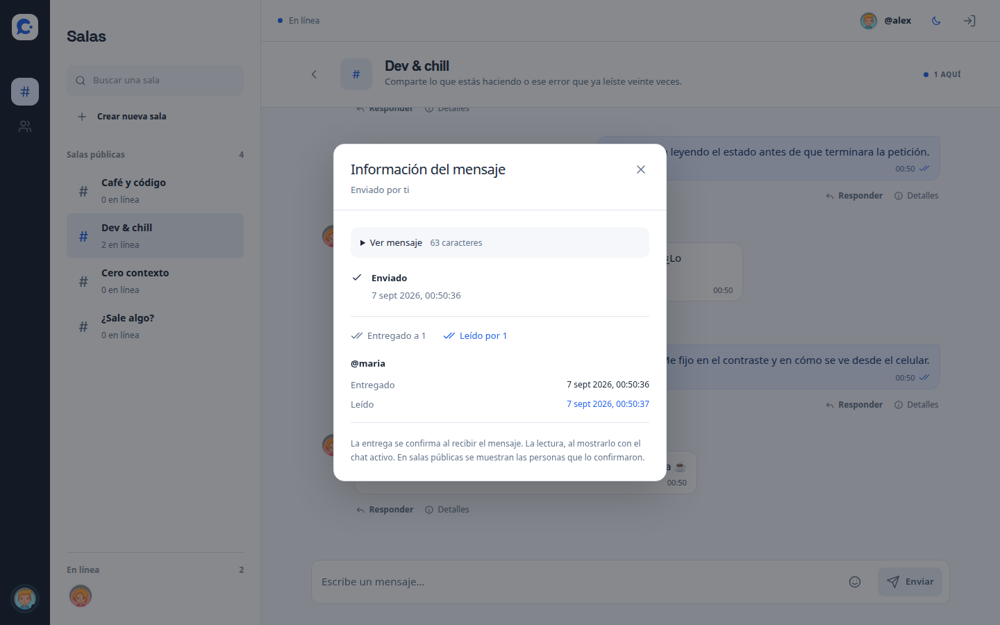

</details>

### 5. Reconexión y mensajes pendientes

Cada envío recibe un `clientMessageId` antes de salir del navegador. Si se pierde la confirmación, el cliente conserva el comando pendiente y lo reintenta con el mismo identificador. El servidor devuelve el registro original cuando recibe un reintento idéntico.

La reconexión valida la sesión, restablece suscripciones y recupera el historial reciente. Los pendientes de sala se reenvían al restaurar o abrir esa sala. Si la sesión del servidor terminó, se descartan las credenciales y los pendientes de esa generación y se vuelve al acceso.

### 6. Tema claro y oscuro

Ambos temas comparten el color de acento, la identidad visual y los controles. El logo y el favicon cuentan con variantes acordes al tema.

<details>
<summary>Ver el chat en modo noche</summary>

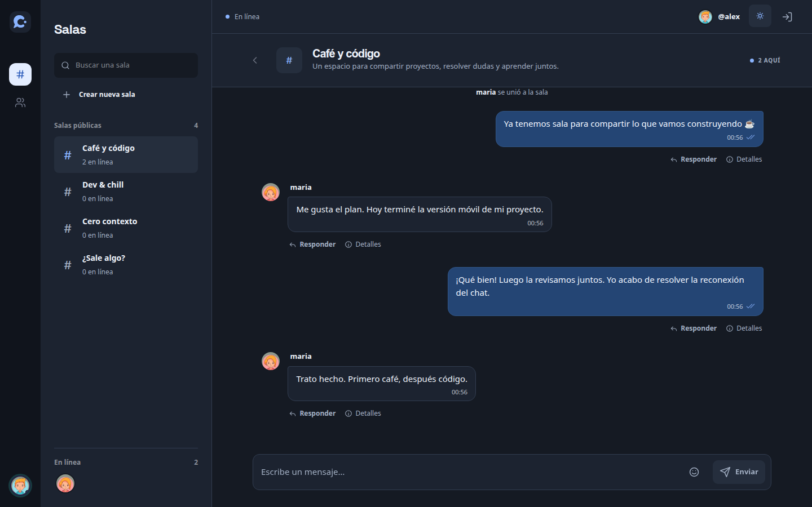

</details>

## Arquitectura

El proyecto se organiza como un **monolito fullstack**. En desarrollo, Vite sirve Vue y redirige las peticiones al backend. Al empaquetar, Spring Boot sirve la interfaz, REST y WebSocket desde un único JAR y puerto.

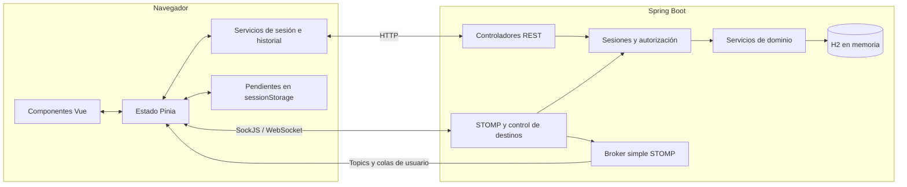

| Responsabilidad | Implementación |
| --- | --- |
| Presentación | Vue controla formularios, mensajes, navegación y diálogos accesibles. |
| Estado del cliente | Pinia coordina presencia, conversaciones, historial y transporte. Los servicios separan credenciales, pendientes y reconciliación de mensajes. |
| REST | Apertura y validación de sesión, directorios, política de sesión e historial paginado. |
| STOMP | Envíos, creación de salas, presencia, aceptación de comandos y confirmaciones. |
| Dominio | Valida destinos, citas y permisos; aplica transacciones e idempotencia. |
| Persistencia | Repositorios JPA sobre H2; mensajes y confirmaciones comparten el ciclo de vida temporal. |
| Operación | Actuator para salud, Micrometer para métricas y restauración automática por inactividad. |

### Recorrido de un mensaje

1. El navegador crea un ID y conserva el comando pendiente antes de enviarlo por STOMP.
2. El servidor obtiene el autor de la sesión y comprueba el destino. En salas exige la suscripción de esa conexión.
3. Una transacción comprueba el ID y guarda el mensaje. La combinación `(userId, clientMessageId)` es única; los envíos concurrentes del autor se serializan con un bloqueo de su fila.
4. Tras completar la transacción, el controlador publica el mensaje y devuelve la aceptación canónica al autor. El cliente elimina el pendiente al recibirla.
5. El receptor confirma entrega y, cuando corresponde, lectura. Estos eventos llevan ID, persona y fechas, sin retransmitir el cuerpo.

Esto garantiza **un registro por comando mientras existe la sesión de datos**. La recuperación se apoya en el historial; no hay un log durable de eventos ni una garantía de entrega distribuida exactamente una vez.

<details>
<summary>Destinos principales del protocolo</summary>

La conexión SockJS se abre en `/ws-chatapp`. `CONNECT` exige `Authorization: Bearer <token>` y el servidor limita los destinos permitidos.

| Destino | Uso |
| --- | --- |
| `/ws/chat.send-message-room` | Enviar a una sala. |
| `/ws/chat.send-direct-message` | Enviar a una persona. |
| `/ws/room.create-room` | Crear una sala. |
| `/ws/chat.delivered-message` | Confirmar recepción mediante `{messageId}`. |
| `/ws/chat.read-message` | Confirmar visualización mediante `{messageId}`. |
| `/topic/chat/room/{roomId}` | Mensajes de una sala pública. |
| `/user/queue/direct` | Mensajes directos de la sesión. |
| `/user/queue/accepted` | Mensaje canónico que confirma un envío. |
| `/user/queue/receipts` | Cambios de entrega y lectura. |
| `/user/queue/errors` | Errores de comandos. |

Los clientes no pueden publicar directamente en los topics del broker ni suscribirse a colas de otro usuario.

</details>

Las decisiones, garantías y límites están ampliados en [Arquitectura de Chatty](docs/chat-architecture.md).

## Modelo de datos

El siguiente diagrama representa las relaciones **lógicas del dominio**. Los identificadores de autor y destino del mensaje son campos escalares; no todas las líneas corresponden a claves foráneas JPA.

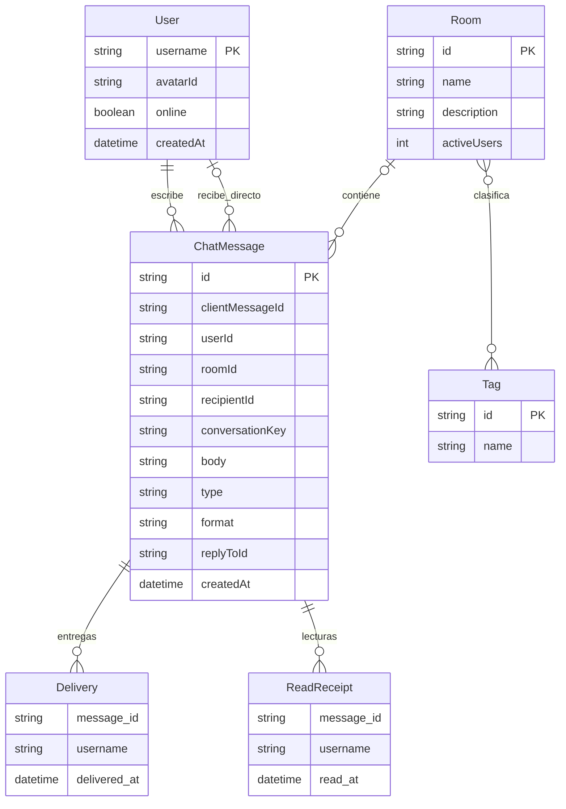

- **User:** el alias identifica al usuario dentro de la generación actual. `online` refleja presencia; la foto se referencia por ID.
- **Room y Tag:** las salas se clasifican mediante `chat_room_tags`. La lista de usuarios de una sala es transitoria y procede de las suscripciones activas.
- **ChatMessage:** un mensaje de conversación tiene sala o destinatario directo. `conversationKey` agrupa el historial de las dos personas. Los eventos del sistema usan los tipos `JOIN` y `LEAVE`; los envíos del cliente aceptan `CHAT` con formato `TEXT`.
- **Citas:** además de `replyToId`, el mensaje conserva autor, cuerpo y fecha del original para reconstruir la respuesta.
- **Confirmaciones:** `deliveredTo` y `readBy` son mapas de alias a fecha, almacenados mediante colecciones JPA en `chat_message_deliveries` y `chat_message_reads`; no son entidades independientes.
- **Índices:** sala/fecha/ID y conversación directa/fecha/ID apoyan la consulta del historial. La restricción autor/ID de cliente evita duplicados.

Las credenciales y la generación de sesión se mantienen en memoria del servidor, fuera de las entidades JPA. Reiniciar los datos también invalida esas credenciales.

## Instalación

### Requisitos

- JDK 17 y Git.
- Acceso a internet para descargar dependencias durante la primera compilación.
- Para trabajar con Vite por separado: Node.js 22.13 o superior de la rama 22 y npm.

Maven Wrapper está incluido. La compilación Maven instala su propia versión de Node y npm para construir el frontend; no requiere instalarlos globalmente para ejecutar el JAR.

### Ejecutar la aplicación completa

```bash
git clone https://github.com/LuchoNoPrograma/chat-websocket.git
cd chat-websocket
bash ./mvnw clean package
java -jar target/chat-websocket-0.0.1-SNAPSHOT.jar
```

Abre **[localhost:7071](http://localhost:7071)**. El mismo proceso sirve la interfaz y el backend. H2 crea el esquema y carga las salas iniciales desde `data.sql`; no necesitas configurar variables de entorno para probarlo.

### Desarrollo con recarga del frontend

En una terminal, desde la raíz:

```bash
bash ./mvnw spring-boot:run
```

En otra:

```bash
cd src/chat-frontend
npm ci
npm run dev
```

Abre **[localhost:7070](http://localhost:7070)**. Vite redirige `/api` y `/ws-chatapp` al backend en `7071`.

### Configuración

| Variable o propiedad | Valor predeterminado | Uso |
| --- | --- | --- |
| `PORT` | `7071` | Puerto de Spring Boot. |
| `CHAT_ALLOWED_ORIGINS` | `http://localhost:7070,http://127.0.0.1:7070` | Orígenes permitidos, separados por comas. |
| `VITE_BACKEND_URL` | Mismo origen si está vacía | URL base que utiliza el cliente para REST y SockJS. Se fija al compilar. |
| `app.data-reset.idle-timeout` | `PT30M` | Inactividad global antes de restaurar los datos. |
| `app.user-session.token-ttl` | `PT2H` | Duración máxima de la credencial. |

Las propiedades Spring se pueden pasar al JAR; por ejemplo, `--server.port=7171`. Si cambias el origen del frontend, actualiza la lista de orígenes permitidos. Para publicar la aplicación, configura HTTPS/WSS y permite el origen público. El empaquetado está preparado para servir una instancia completa.

## Cómo probar el proyecto

Abre la aplicación en **dos navegadores o perfiles independientes**, con aliases distintos. Así cada persona tiene su propia credencial.

| Paso | Acción | Resultado esperado |
| --- | --- | --- |
| 1 | Entrar como `alex` y `maria`, eligiendo una foto en cada sesión. | Ambos aparecen en Personas y se actualiza la presencia. |
| 2 | Entrar en Dev & chill desde ambos navegadores y enviar un mensaje. | El mensaje aparece en la otra sesión sin recargar. |
| 3 | Crear una sala con nombre y descripción. | Aparece en el directorio de ambos clientes. |
| 4 | Abrir un directo desde Personas y responder citando un mensaje. | La conversación muestra la respuesta junto a su contexto. |
| 5 | Enviar un texto de más de 650 caracteres. | Aparece Leer más; el contenido se puede expandir y volver a plegar. |
| 6 | Recibir un mensaje con la conversación fuera de foco y después enfocarla. Abrir Detalles en el emisor. | Entrega y lectura se registran por separado con horas del servidor. |
| 7 | Poner un navegador sin conexión, enviar desde el otro y restablecer la red. | El cliente reconecta y recupera el mensaje desde el historial. |
| 8 | Cambiar el tema y reducir la ventana al ancho de un celular. | El chat se adapta y el directorio pasa a un panel desplegable. |
| 9 | Cerrar sesión e intentar usar su credencial anterior. | El servidor rechaza la credencial revocada. |

Las capturas de este README se tomaron de la aplicación funcionando contra una instancia local de Spring Boot, con dos sesiones independientes y mensajes de prueba. Incluyen escritorio y móvil de 390 px, en claro y oscuro.

### Comprobaciones locales

Desde la raíz:

```bash
bash ./mvnw test
```

Desde `src/chat-frontend`:

```bash
npm run typecheck
npm run lint
npm run build
```

Las pruebas Java cubren permisos, revocación, generación de sesión, envíos concurrentes con el mismo ID, conflictos de contenido, historial, confirmaciones y restauración de datos. Las comprobaciones frontend validan tipos, reglas de código y compilación.

Para comprobar REST/STOMP sobre un servidor real, inicia **una instancia local aislada** desde la raíz:

```bash
java -jar target/chat-websocket-0.0.1-SNAPSHOT.jar \
  --server.port=7171 \
  --app.cors.allowed-origins=http://127.0.0.1:7170
```

En otra terminal, con Python 3 y un entorno virtual:

```bash
python3 -m venv /tmp/chatty-protocol-venv
/tmp/chatty-protocol-venv/bin/pip install websockets
CHAT_TEST_URL=http://localhost:7171 \
CHAT_TEST_ORIGIN=http://127.0.0.1:7170 \
/tmp/chatty-protocol-venv/bin/python scripts/verify-chat.py
```

La prueba crea aliases temporales y verifica autorización, aceptación, recibos, reintentos sin duplicados, reconexión, destinos restringidos y revocación. No necesita Vite ni imprime las credenciales.

La salud del backend está disponible en [localhost:7071/actuator/health](http://localhost:7071/actuator/health). Micrometer registra mensajes creados/reintentados, recibos, comandos rechazados y conexiones activas. La exposición HTTP predeterminada de Actuator se limita a `health` e `info`.

## Tecnologías

| Tecnología | Uso en el proyecto |
| --- | --- |
| Java 17 y Spring Boot 3 | API, configuración y ejecución del servidor. |
| Spring WebSocket, STOMP y SockJS | Transporte bidireccional, suscripciones y colas por usuario. |
| Spring Data JPA y H2 | Modelo relacional temporal, consultas, transacciones e índices. |
| Bean Validation | Validación de los datos de entrada. |
| Vue 3 y TypeScript | Componentes y contratos tipados del cliente. |
| Pinia y Vue Router | Estado reactivo y navegación. |
| Vite, Tailwind CSS y CSS propio | Desarrollo, compilación y diseño adaptable. |
| Motion-v | Transiciones de la interfaz. |
| Actuator y Micrometer | Salud y métricas del backend. |
| JUnit, Spring Boot Test y Playwright | Pruebas de backend y comprobación del flujo en navegador. |
| Maven Wrapper y frontend-maven-plugin | Construcción conjunta de frontend y backend en un JAR. |

## Estructura del código

```text
src/
├── chat-frontend/
│   ├── public/                     # Fotos de perfil, marca y favicon
│   └── src/
│       ├── views/                  # Acceso y espacio de conversaciones
│       ├── components/common/      # Mensajes, diálogos y controles compartidos
│       ├── stores/                 # Coordinación del tiempo real y tema
│       ├── services/               # Sesión, pendientes y reconciliación
│       ├── types/                  # Contratos TypeScript
│       └── assets.css              # Estilos y adaptación a móvil
├── main/java/luis/fluoxetina/chatwebsocket/
│   ├── config/                     # CORS y transporte WebSocket
│   ├── controller/                 # Entradas REST y STOMP
│   ├── session/                    # Credenciales, permisos y conexiones
│   ├── messaging/                  # Comandos idempotentes, recibos y métricas
│   ├── model/                      # Entidades, repositorios y servicios
│   ├── dto/                        # Contratos de entrada y salida
│   ├── mapper/                     # Conversión entre modelos y DTO
│   ├── event/                      # Presencia y suscripciones
│   └── lifecycle/                  # Restauración por inactividad
├── main/resources/                 # Configuración y data.sql
└── test/                           # Pruebas Java
scripts/verify-chat.py               # Comprobación del protocolo real
docs/chat-architecture.md            # Decisiones y garantías técnicas
docs/capturas/                      # Capturas reales de la aplicación
```

## Datos y alcance

- **Estado efímero:** H2 vive en memoria. Reiniciar el proceso borra usuarios, salas creadas, mensajes y confirmaciones, y restaura los datos iniciales. También se restauran tras 30 minutos sin actividad REST, SockJS o STOMP, en la siguiente comprobación o petición.
- **Identidad temporal:** existe autorización mediante tokens, pero no cuentas permanentes, contraseñas ni recuperación de identidad. Un alias reservado vuelve a estar disponible al reiniciar los datos.
- **Una instancia:** el broker simple de Spring y la presencia residen en el proceso. Escalar a varias instancias requeriría compartir sesiones y presencia, utilizar un broker externo y revisar la persistencia.
- **Recuperación acotada:** los pendientes sobreviven en la pestaña durante la generación vigente. No existe historial durable entre reinicios ni sincronización de pendientes entre dispositivos.
- **Lectura observable:** confirma visualización en el cliente, no que una persona haya comprendido el contenido. Los directos están autorizados por sesión, pero no tienen cifrado de extremo a extremo.
- **Solo texto por diseño:** no hay almacenamiento de archivos, carga de fotos, audio o video. Los recursos visuales del perfil forman parte de la interfaz.

Para volver al estado inicial en local, detén y arranca el backend. Esto afecta a todas las sesiones de esa instancia; los clientes deberán volver a entrar.
